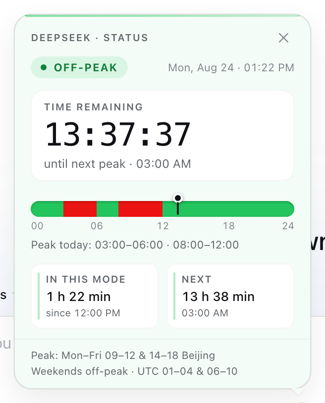
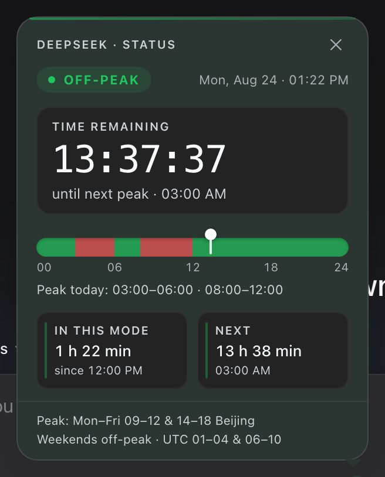

# dsh-deepseek-peak-indicator

A [DeepSeek Harness](https://github.com/deepseek-ai/deepseek-harness) web plugin that shows a small **green/red status dot** in the composer bar, immediately **left of the model-select menu**, indicating whether the DeepSeek API is currently in official **peak time (red)** or **off-peak (green)**.


## Screenshots

Light | Dark
:---: | :---:
 | 

## What it does

| Dot | Meaning |
| --- | --- |
| 🟢 green | DeepSeek API **off-peak** — standard rates, usually faster |
| 🔴 red | DeepSeek API **peak time** — official peak window (rates doubled, higher load) |

Hovering the dot shows the current tier, when the next transition happens (in your local time), and the official schedule. **Clicking the dot** opens a polished dashboard panel:

- a **mode pill** (`● PEAK` / `● OFF-PEAK`) with a mode-tinted hairline accent,
- a **countdown card** — "Time remaining" with a live 32px tabular countdown (ticking every second; amber pulse in the final minute) and a caption for the next transition,
- a **live token-cost card** — V4.1 Flash rates (per 1M tokens, with a **元/$ switch**) for cached input, input and output, off-peak vs peak side by side — the **currently active rates are highlighted**, so you see what tokens cost right now,
- a **24-hour day track** — a seamless red/green gradient of peak/off-peak hours in *your* local time, with a **"now" marker** (ring + line) aligned to exact hour ticks and a summary line,
- **stat tiles** — "In this mode" (elapsed + since) and "Next" (relative + absolute time),
- a compact two-line schedule footnote.

The panel closes on outside click, `Escape`, or the close button; **Tab cycles** the panel's controls while open. It flips to the new mode automatically at a window boundary. Motion (panel entrance, pill pop, marker glide) respects `prefers-reduced-motion`, and the styles use the host theme's tokens so the panel matches light and dark themes.

The tier follows the official DeepSeek schedule — [Models & Pricing](https://api-docs.deepseek.com/quick_start/pricing) — plus the peak/off-peak billing notices:

> **2026-08-23** — Weekends (Saturday and Sunday, Beijing Time): the peak/off-peak time divisions no longer apply — all calls are charged uniformly at the off-peak rate.
>
> **2026-09-10** — V4.1 Flash pricing takes effect (04:00 UTC). From **12:00 Beijing on 2026-09-14** (04:00 UTC), V4 Pro requests are routed to V4.1 Flash and billed at Flash rates; before that, Pro keeps its own unchanged pricing. The legacy model names `deepseek-v4-flash` and `deepseek-v4-flash-vision-exp` are retired and served as V4.1 Flash at Flash prices.

Cost card rates (per 1M tokens, peak = exactly 2× off-peak — both tables are official and never inter-converted):

| V4.1 Flash | off-peak | peak |
| --- | --- | --- |
| input, cache hit | 元0.02 · $0.003 | 元0.04 · $0.006 |
| input, cache miss | 元1 · $0.15 | 元2 · $0.30 |
| output | 元4 · $0.60 | 元8 · $1.20 |

So in Beijing time: **peak = 09:00–12:00 and 14:00–18:00, Mon–Fri** (01:00–04:00 and 06:00–10:00 UTC); **weekends are off-peak all day**. The day-of-week check is evaluated on the **Beijing wall clock**, exactly as the billing rule states. The indicator is computed from the local clock, so it works offline and flips exactly at the boundary (refreshed every 30s; per-second while the panel is open).

> **Maintenance note** — when DeepSeek changes prices, update `RATES_CNY` / `RATES_USD` in `lib/client.js` (they are the single source of truth). While V4 Pro is still separately priced, the card shows a short auto-expiring note; it disappears by itself once Pro is routed to Flash (`PRO_ROUTED_FROM`).

## Install

```sh
# npm (recommended)
dsh plugin --profile web add dsh-deepseek-peak-indicator

# GitHub
dsh plugin --profile web add git+https://github.com/DDA-DIGITAL/dsh-deepseek-peak-indicator.git

# local checkout (development)
dsh plugin --profile web add link:/path/to/dsh-deepseek-peak-indicator
```

Then restart the web profile (`dsh --profile web`) so the loader picks up the new bundle. After that, the client half hot-reloads on changes (the built-in HMR poller watches plugin client bundles).

## Development

No build step — the browser half (`lib/client.js`) is the shipped artifact.

```sh
npm test    # schedule + formatting unit tests (also runnable with TZ=UTC / TZ=Asia/Shanghai)
npm run check   # syntax-check the bundles
```

Edit `lib/client.js` → the running GUI hot-reloads the change (no restart). The panel is a React component registered into the **`conversation.input.right`** UI slot; styling lives in one scoped stylesheet (`dpk-*` classes) injected by the client half.

## How it works

- `cordis.patch.yml` — the `dsh.bundle.patch` layer: inserts the plugin row `{ id: deepseek-peak-indicator, name: 'dsh-deepseek-peak-indicator' }` into the profile's plugin tree.
- `lib/index.js` — node half: empty `apply`, so the row is a valid loader entry (the browser does all the work).
- `lib/client.js` — browser half (declared via `dsh.client` + `exports["./client"]`, served at `/plugins/dsh-deepseek-peak-indicator/client.js`): registers a React occupant into the **`conversation.input.right`** UI slot. ConversationRoot renders that slot's entries immediately before the `conversation.input.model` seat, which places the dot exactly left of the model menu.

No server half, no network calls, no dependencies beyond the shell's static `react` module.

## Compatibility

Targets the current DeepSeek Harness web client slots API (`conversation.input.right`). If a future DSH release reshapes the composer slots, this plugin may need a compatibility bump.

## License

MIT — see [LICENSE](LICENSE).
